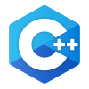
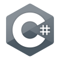

<h1 align="center"> <b> Hello, I'm Alper. </b> </h1>

    

<h3 align="center"><b> Most Used Language</b></h3>

 
      

<h3 align="center"><b>Languages & Tools</b></h3>

    
    
    
    

  

 
    C++ | C# | Python | Java

    
    
    

  

 
    Visual Studio | VS Code | IntelliJ IDEA

<h3 align="center"><b>Stats</b></h3>

