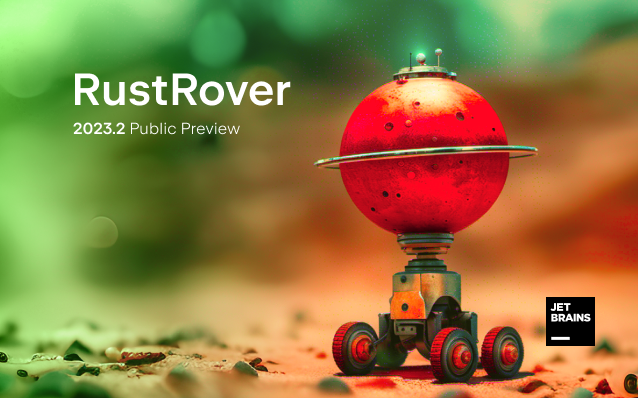

# Hi 👋, I'm Alper
### I'm Software Developer, Pixel Artist and Linux Enthusiast.

- 🔭 I’m currently working on some CLI tool projects.

- 🌱 I’m currently learning [**Go Programming Language**](https://github.com/golang/go) and [**Rust**](https://github.com/rust-lang/rust).

- 👨‍💻 All of my projects are available at [https://lnxwizard.github.io/projects](https://lnxwizard.github.io/projects)

- 📝 I regularly write articles on [https://lnxwizard.github.io/blog](https://lnxwizard.github.io/blog)

- 🌐 My official website is [https://lnxwizard.github.io](https://lnxwizard.github.io). 
  
  I write documents and blogs about my projects on my website. I think you should take a look.

- 📫 How to reach me **alperakca79@outlook.com**

- 🇹🇷 I'm From Turkey

### Languages:

I learned , my first programming language, 2 years ago and developed projects. But I've taken a break from  for now.

After , I learned , but I did not develop many projects.

4 months ago, the idea of developing command line tools came to my mind. I heard that the  language has very good packages for developing command line tools and I started learning it right away. I wrote small command line tools in . I still use this language.

I learned  with Linux. I wrote beautiful scripts with this language.

I'm new to the  programming language. I started learning 3 weeks ago (August 20). It caught my attention that it has been chosen as my favorite programming language many times on StackOverflow. The  community also said that this language is very good. I started learning  right away. Indeed, as the community says,  is a powerful and beautiful language.

I'm using JetBrains RustRover IDE for  programming.

      

I use  as my main version control tool. The best in its field.

### Tools

### My System

### GitHub Stats

